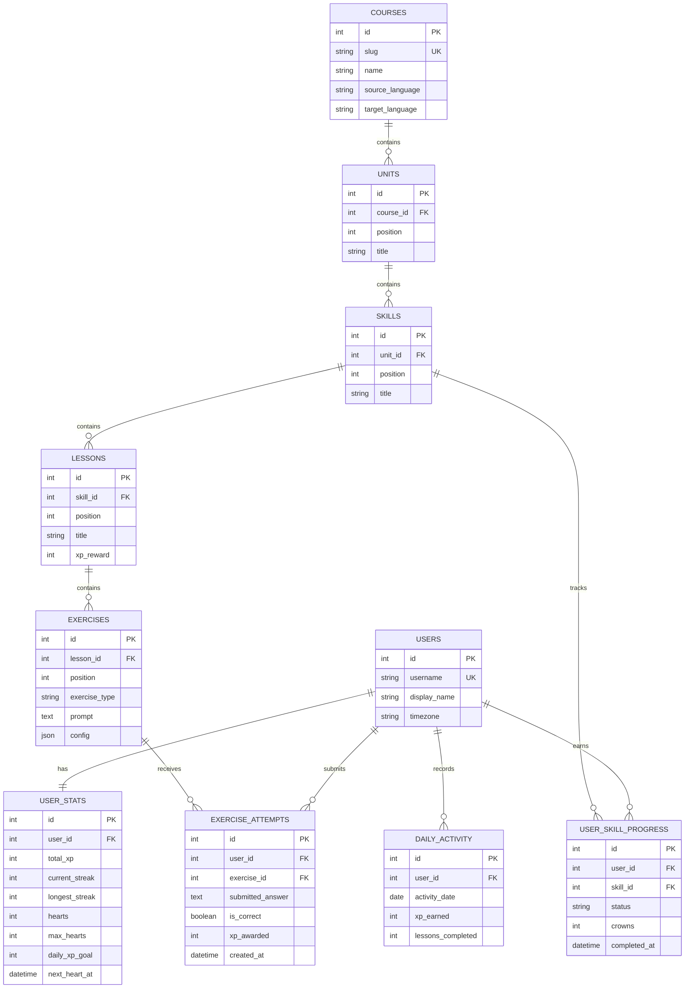

# Lingo Path

Lingo Path is a full-stack, Duolingo-inspired language-learning app. It teaches Spanish from English through a winding skill path, short lessons, and saved learner progress. The repository includes a Next.js frontend and a FastAPI backend backed by SQLite.

> **Course:** Spanish Foundations (English → Spanish) · **Hosted demo:** Not configured yet; follow the local setup below to run the app.

## Features

- **Learning path:** Seven units with ten skill nodes per unit. Nodes show locked, available, and completed states; completing skills advances progress and unlocks rewards.
- **Varied lessons:** Multiple choice, typed translation, word bank, matching, and fill-in-the-blank exercises. Lessons rotate exercise order so consecutive nodes do not always start with the same format.
- **Feedback and progress:** Immediate answer feedback, accent correction for Spanish answers, hearts and recovery, lesson XP, daily goal, streaks, quests, achievements, and a seeded leaderboard.
- **Browser-specific progress:** A new browser profile receives its own fresh learner. Reopening the app in that browser resumes its saved progress; another browser on the same computer starts separately.
- **Reward and account pages:** Learn, Practice, Leaderboards, Quests, Shop, Profile, and More/settings pages share the app navigation.
- **Responsive UI:** Desktop, tablet, and mobile layouts, with mobile navigation and responsive lesson controls.
- **Theme preference:** Light/dark theme preference is saved in the browser.

## Tech stack

| Area | Technology |
| --- | --- |
| Frontend | Next.js 16 App Router, React 19, TypeScript 5 |
| Styling | CSS in `frontend/app/globals.css` |
| Backend | Python 3.10+, FastAPI |
| ORM and database | SQLAlchemy, SQLite |
| Schema migrations | Alembic |

Next.js 16 requires Node.js 20.9 or newer. Python 3.10 or newer is required by the backend type syntax.

## Architecture

```text
Browser
  └─ Next.js frontend (frontend/)
       ├─ /                         Learn path and lesson player
       ├─ /practice                 Practice
       ├─ /leaderboards              Leaderboards
       ├─ /quests                    Quests
       ├─ /shop                      Shop
       ├─ /profile                   Profile
       └─ /more                      More and settings
              │ HTTP JSON (NEXT_PUBLIC_API_URL)
              ▼
       FastAPI backend (backend/app/main.py)
         ├─ /path                    Learning path API
         ├─ /lessons                 Lesson and answer APIs
         ├─ /profile                 Learner stats and heart refill
         └─ /leaderboard             Seeded leaderboard API
              │ SQLAlchemy
              ▼
          SQLite (backend/lingo_path.db)
```

The frontend uses the Next.js App Router. The main Learn path and lesson player live in `frontend/app/page.tsx`; shared navigation and the secondary sections are in `frontend/app/components/` and the route folders. FastAPI mounts the path, lesson, profile, and leaderboard routers in `backend/app/main.py`. The frontend calls the backend directly over JSON HTTP; there is no separate authentication service. On first visit, the browser saves a random browser ID in local storage and calls `POST /profile/bootstrap`. The API uses that ID to create or retrieve the matching anonymous learner row, so learner progress is stored in SQLite but scoped to that browser profile.

## Database schema

Alembic migrations define the schema, and SQLAlchemy models are in `backend/app/models/`.



`USER_SKILL_PROGRESS` connects learners to skills and stores each skill's lock/completion status and crowns. `DAILY_ACTIVITY` stores XP and completed lessons by learner and date. Exercise configuration is JSON so each exercise type can store its own choices, word bank, or matching pairs. The demo database is local and ignored by Git.

## Run locally

You need Git, Python 3.10+, Node.js 20.9+, and npm. Start the backend and frontend in separate terminals.

### 1. Set up and seed the backend

From the repository root in PowerShell:

```powershell
Set-Location .\backend
py -3 -m venv .venv
.\.venv\Scripts\Activate.ps1
python -m pip install --upgrade pip
python -m pip install -r requirements.txt
alembic upgrade head
python -m app.db.seed
python -m app.db.seed_leaderboard
uvicorn app.main:app --reload --host 127.0.0.1 --port 8000
```

The API is at <http://127.0.0.1:8000>; interactive API documentation is at <http://127.0.0.1:8000/docs>. The seed command creates the Spanish course, expands each unit to ten skill nodes, and creates `demo-learner`. The leaderboard seed adds sample learners; running it again resets those sample learners' XP, streaks, hearts, and daily goals.

If PowerShell blocks virtual-environment activation, allow it for the current terminal only, then activate:

```powershell
Set-ExecutionPolicy -Scope Process -ExecutionPolicy RemoteSigned
.\.venv\Scripts\Activate.ps1
```

### 2. Set up the frontend

In a second terminal from the repository root:

```powershell
Set-Location .\frontend
npm install
npm run dev
```

The frontend defaults to `http://127.0.0.1:8000` for the API. To use a different backend address, create `frontend/.env.local`:

```env
NEXT_PUBLIC_API_URL=http://127.0.0.1:8000
```

Open <http://localhost:3000>.

### Production frontend build

With dependencies installed, from `frontend/`:

```powershell
npm run build
npm run start
```

For a deployment, set `NEXT_PUBLIC_API_URL` to the reachable API URL and configure the FastAPI CORS allowlist in `backend/app/main.py` for the deployed frontend origin. This repository does not currently include a hosting-provider configuration.

## API overview

All endpoints return JSON. The `demo-learner` row is created by the seed script; browser sessions use a generated username returned by `/profile/bootstrap`.

| Method | Endpoint | Purpose |
| --- | --- | --- |
| `GET` | `/health` | API health check. |
| `POST` | `/profile/bootstrap` | Create or retrieve the anonymous learner for a browser ID. |
| `GET` | `/path/{username}` | Course units, skills, lessons, and learner progress. |
| `GET` | `/lessons/{lesson_id}?username={username}` | Load a lesson and its exercises. |
| `POST` | `/lessons/{lesson_id}/answer` | Submit an exercise answer and update attempt/progress data. |
| `GET` | `/profile/{username}` | Load learner stats, hearts, daily activity, quests, and achievements. |
| `POST` | `/profile/{username}/refill-hearts` | Use the demo heart refill flow. |
| `GET` | `/leaderboard?username={username}` | Return seeded competitors and the current learner, ranked by XP. |

Example browser bootstrap request:

```http
POST /profile/bootstrap
Content-Type: application/json
```

```json
{
  "browser_id": "550e8400-e29b-41d4-a716-446655440000"
}
```

The response contains a generated `username`. Use it in subsequent path, profile, lesson, answer, and heart-refill requests.

Example answer request:

```http
POST /lessons/1/answer
Content-Type: application/json
```

```json
{
  "username": "browser-550e8400e29b41d4a716446655440000",
  "exercise_id": 1,
  "answer": "Hola"
}
```

## Assumptions and demo limitations

- The app uses anonymous, browser-scoped learner IDs; authentication, registration, and account switching are not implemented. Clearing that browser's local storage creates a new learner on its next visit. Progress is not shared between browsers or synced across devices.
- Spanish-from-English is the only seeded course. Lesson content is sample curriculum data stored in the database.
- Leaderboard ranks are seeded examples, not a multi-user live competition.
- Shop subscriptions and purchases are presentation placeholders. Gems and unit-chest claim state are demo mechanics stored in browser local storage.
- Theme preference is stored in browser local storage. Learner XP, hearts, streaks, attempts, course progress, and daily activity are stored in SQLite.
- The backend uses a local SQLite database and is intended for this single-instance demo, not production multi-user deployment.
- No hosted demo URL is configured yet.

## Repository layout

```text
backend/
  app/
    api/routes/       # FastAPI path, lesson, profile, and leaderboard routes
    db/               # SQLite connection and seed/course expansion scripts
    models/           # SQLAlchemy schema models
    main.py           # FastAPI app and CORS setup
  migrations/         # Alembic migration environment and revisions
  requirements.txt
frontend/
  app/
    components/       # Shared navigation and secondary section pages
    practice/         # Practice route
    leaderboards/     # Leaderboard route
    quests/           # Quests route
    shop/             # Shop route
    profile/          # Profile route
    more/             # Settings and other options
    page.tsx          # Learn path and lesson player
    globals.css       # Responsive styling and animations
```
